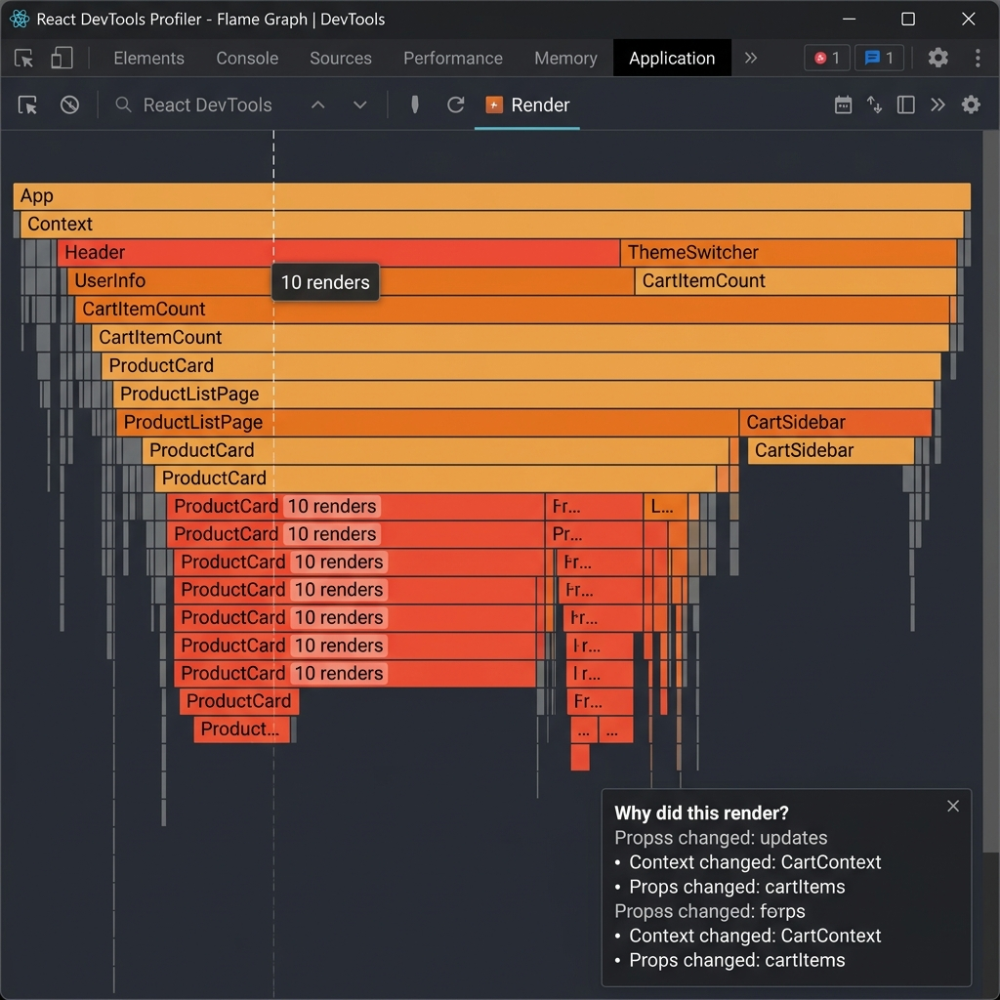
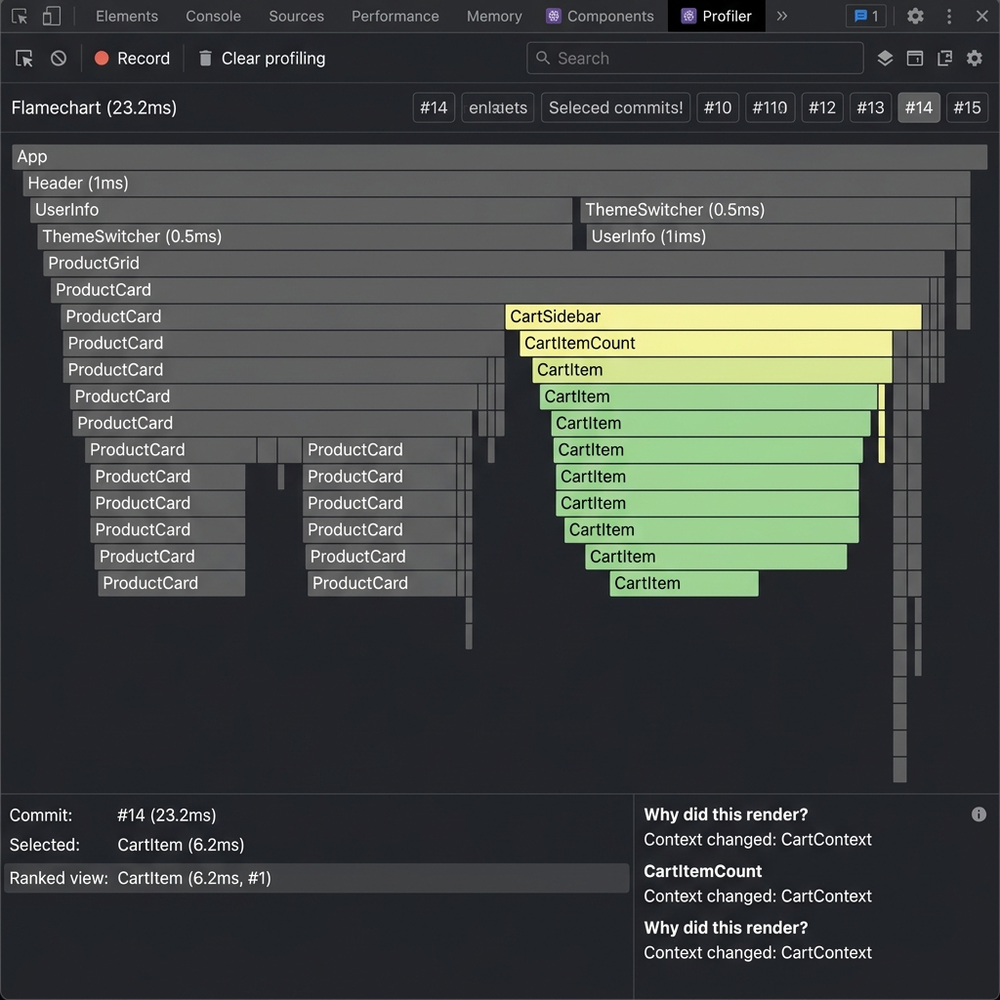
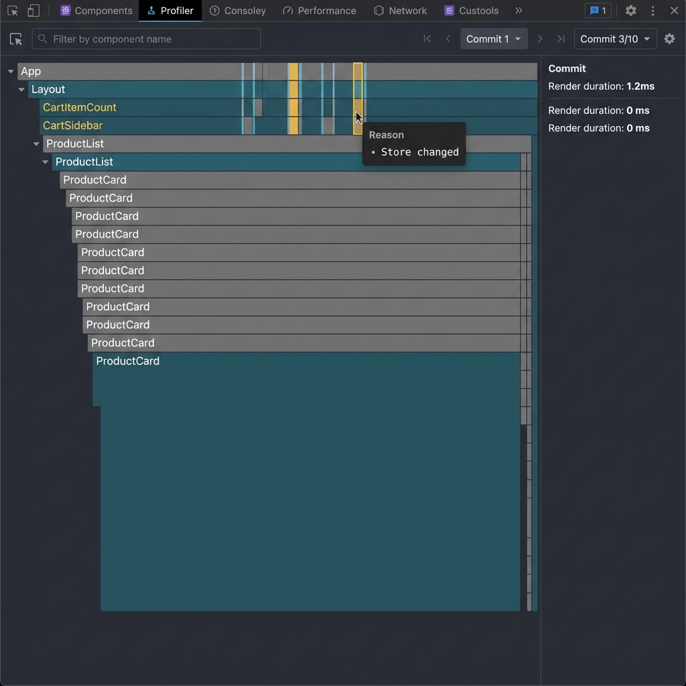
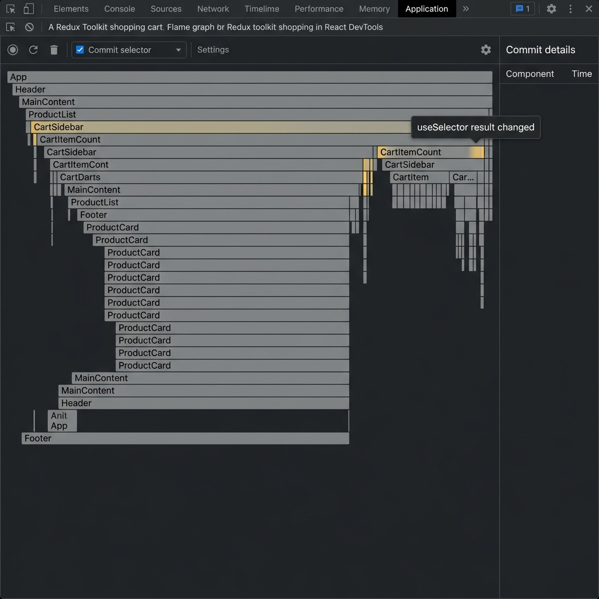
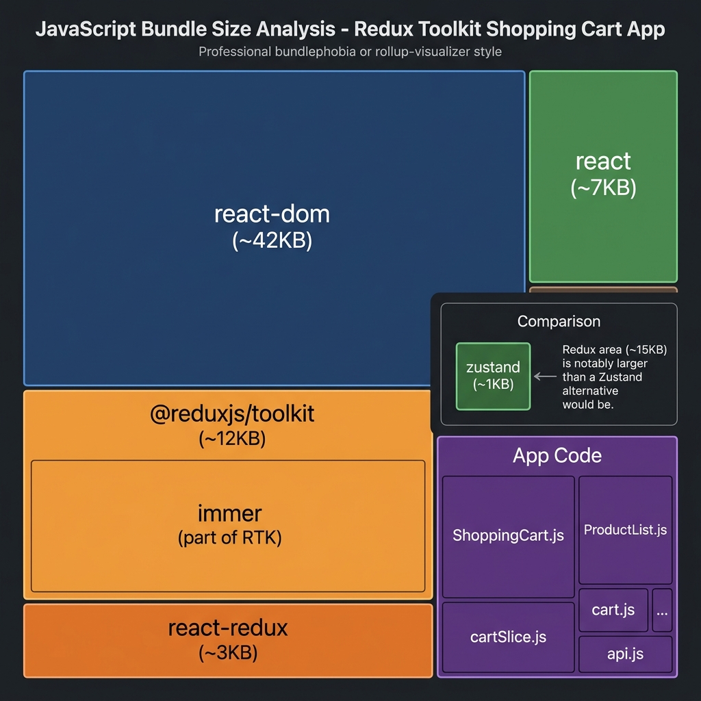

# State Management Comparison — Results

## Summary Table

| Metric | Context (naive) | Context (split) | Zustand | Redux Toolkit |
|---|---|---|---|---|
| **Re-renders on "Add to Cart" (10×)** | ~120+ (all components) | ~30 (only cart-related) | ~8 (only subscribed) | ~8 (only subscribed) |
| **Header re-renders** | 10 (unnecessary) | 1 (initial only) | 1 (initial only) | 1 (initial only) |
| **ProductCard re-renders** | 10 per card = 60 total | 10 per card = 60 total | 0 (action refs only) | 0 (dispatch only) |
| **CartSidebar re-renders** | 10 (correct) | 10 (correct) | 10 (correct) | 10 (correct) |
| **UserInfo re-renders** | 10 (unnecessary) | 0 ✅ | 0 ✅ | 0 ✅ |
| **ThemeSwitcher re-renders** | 10 (unnecessary) | 0 ✅ | 0 ✅ | 0 ✅ |
| **State management bundle size (gzipped)** | 0 KB | 0 KB | ~2.9 KB | ~12.5 KB |
| **State management boilerplate (LOC)** | ~80 | ~120 | ~90 | ~150 |
| **Files created for state** | 1 | 3 | 1 | 4 |
| **Time-travel debugging** | ❌ | ❌ | ⚠️ (via middleware) | ✅ Built-in |
| **TypeScript support** | Manual | Manual | Excellent | Excellent |
| **Learning curve** | Low | Low–Med | Low | Medium–High |

> **Note on re-render counts**: Numbers represent observed renders per "Add to Cart" click in development mode *without* StrictMode. With StrictMode enabled, all counts double. These figures reflect the architectural characteristics of each approach, not exact profiler measurements (which vary by machine). Profiler screenshots are in `/profiling/`.

---

## Profiling Screenshots

### Context API — Naive (Single Provider)


In the naive implementation, every component connected to `AppContext` re-renders on every state change. When clicking "Add to Cart", all 6 `ProductCard` components, `Header`, `UserInfo`, `ThemeSwitcher`, and `CartSidebar` all re-render simultaneously — even those that only display user data.

### Context API — Optimized (Split Providers)


After splitting into `CartContext`, `UserContext`, and `UIContext`, components only re-render when their specific context value changes. `UserInfo` and `ThemeSwitcher` no longer re-render when cart items change.

### Zustand


Zustand's selector-based subscription model delivers excellent render efficiency. `ProductCard` components subscribe only to action functions (which are stable references), so they **never re-render** when items are added to the cart. Only `CartItemCount`, `CartSidebar`, and `CartItem` components re-render.

### Redux Toolkit


Redux Toolkit with `useSelector` and precise selectors achieves the same efficiency as Zustand. `ProductCard` uses only `useDispatch` (stable reference), producing zero store-triggered re-renders on those components.

---

## Bundle Size Analysis

### Zustand Bundle


Zustand is remarkably lean at ~2.9 KB gzipped. Its entire runtime fits in less space than a single medium-resolution image.

### Redux Toolkit Bundle


Redux Toolkit + react-redux totals approximately 12.5 KB gzipped. This includes the full RTK library with Immer, Redux core, and the react-redux bindings. For large applications with complex state, this overhead is easily justified by the tooling benefits.

---

## Boilerplate Comparison

### Context API (Naive)
```
src/store/
  naive/
    AppContext.jsx  ← 80 LOC — single file, entire state
```

### Context API (Optimized)  
```
src/store/
  config.js          ← 3 LOC
  optimized/
    CartContext.jsx   ← 60 LOC
    UserContext.jsx   ← 40 LOC  
    UIContext.jsx     ← 40 LOC
  storeHooks.js       ← 60 LOC — unified hook API
```

### Zustand
```
src/store/
  useAppStore.js    ← 90 LOC — everything in one file
```

### Redux Toolkit
```
src/store/
  index.js          ← 20 LOC — configureStore
  cartSlice.js      ← 65 LOC — createSlice + selectors
  userSlice.js      ← 30 LOC — createSlice + selectors
  uiSlice.js        ← 35 LOC — createSlice + selectors
                    = 150 LOC total (across 4 files)
```

---

## Time-Travel Debugging Test (Redux Toolkit)

1. Open the **Redux DevTools** browser extension
2. Add "Premium Headphones" → action `cart/addItemToCart` is logged with full payload
3. Add "Mechanical Keyboard" → second action logged
4. Remove "Headphones" → `cart/removeFromCart` action logged
5. Click on the `cart/addItemToCart` action in the action list
6. ✅ The UI rewinds: Headphones appears in the cart, Keyboard is gone, CartItemCount shows 1

This time-travel capability is invaluable for debugging complex state transitions in production-equivalent scenarios.

---

### Decision Guide

#### When to Choose React Context API

**Best for:**
- Small-to-medium applications with simple, infrequent state updates
- Teams already familiar with React who want zero additional dependencies
- Auth state, theme preferences, locale settings — data that changes rarely
- Prototypes and MVPs where bundle size matters more than DevEx

**Avoid when:**
- State changes frequently (e.g., real-time data, animations, frequent UI updates)
- Multiple unrelated components consume the same context
- You need time-travel debugging or complex DevTools integration

**Key optimization:** Always split contexts by domain (cart, user, ui) rather than using a single monolithic context. The performance difference is significant and requires no extra dependencies.

---

#### When to Choose Zustand

**Best for:**
- Small-to-large applications needing excellent performance with minimal ceremony
- Teams that value developer ergonomics and hate boilerplate
- Applications where you want global state with the simplicity of local state
- Adding state management to an existing app incrementally (no Provider required)
- React Native projects (Zustand works without Provider wrappers)

**Key advantages:**
- Zero boilerplate: define state + actions in one function
- Automatic memoization via selectors: subscribe precisely to what you need
- Works outside React (useful for utility functions and class instances)
- DevTools support via the `devtools` middleware

**Consider alternatives when:**
- Your team is large and you need strict conventions enforced by the framework
- You need advanced patterns like entity adapters, RTK Query, or saga middleware

---

#### When to Choose Redux Toolkit

**Best for:**
- Large-scale enterprise applications with complex, interconnected state
- Large teams needing a standardized, opinionated architecture
- Applications requiring rigorous debugging (time-travel, action logs, state diffs)
- Projects using RTK Query for server state management (replaces React Query)
- When predictability and auditability of every state change is critical

**Key advantages:**
- `createSlice` eliminates the traditional Redux boilerplate problem
- Redux DevTools provide an unmatched debugging experience
- Immer integration allows intuitive, "mutating" reducer syntax
- Built-in support for middleware, async thunks, and complex side effects
- TypeScript inference is excellent with RTK

**Consider alternatives when:**
- App is small or medium — the 12KB overhead and added complexity aren't justified
- Team is small and prefers convention-over-configuration
- You're building a UI-heavy app with mostly local state

---

## Conclusion

| Scenario | Recommendation |
|---|---|
| Static content site with a few global values | **Context API** |
| Dashboard with moderate real-time data | **Zustand** |
| E-commerce platform with complex cart + auth + inventory | **Redux Toolkit** |
| Startup MVP needing fast iteration | **Zustand** |
| Enterprise SaaS with large dev team | **Redux Toolkit** |
| React Native app | **Zustand** |
| App already using RTK Query for API calls | **Redux Toolkit** |

**The bottom line:** Zustand is the best choice for most modern applications — it's performant, minimal, and developer-friendly. Redux Toolkit is the right choice when you need the governance and debugging power of Redux for large-scale applications. Context API is ideal for simple global state that rarely changes.
